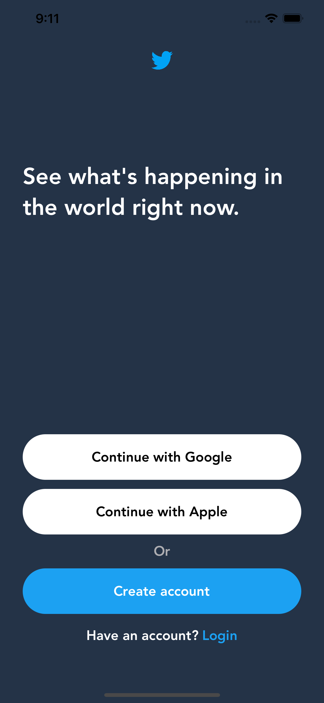

# twitter clone

## Description
This is just a little practice building UI programmatically without storyboards

## Note 🚧:
This application was built using:
* Xcode 12.5.1
* Programmatic UI

## Screenshots 📲

